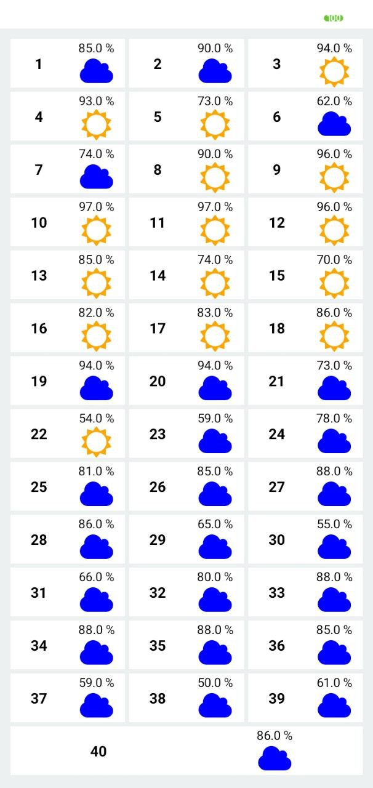
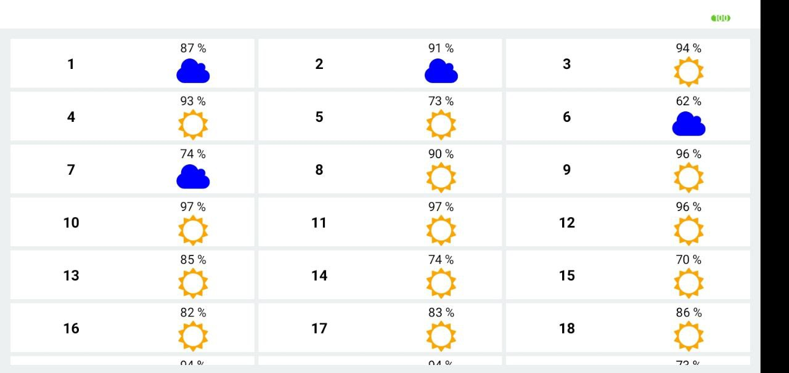

# Offline first weather App

Offline first weather app using redux toolkit and sqlite 2

## Portrait View



## Landscape View



## Setup

### Install the dependencies

```shell
# yarn
yarn install

# npm
npm install
```

### Install pods

```
pod install
```

### Run the metro bundler

```
yarn start
```

### Run the application on the device

```shell
# android
yarn android

# ios
yarn ios

# web
yarn web
```
